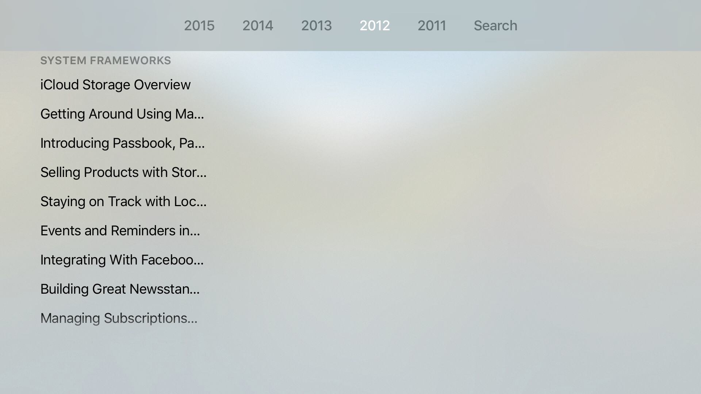
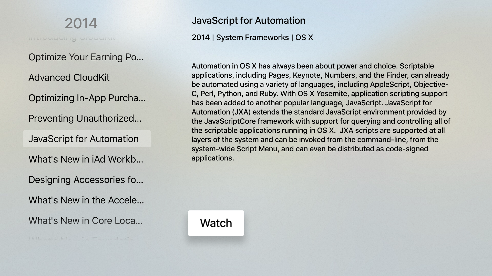
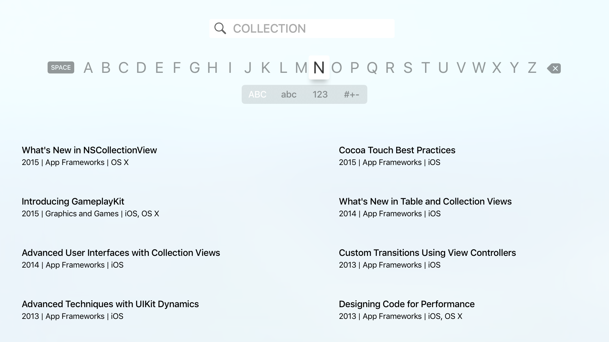
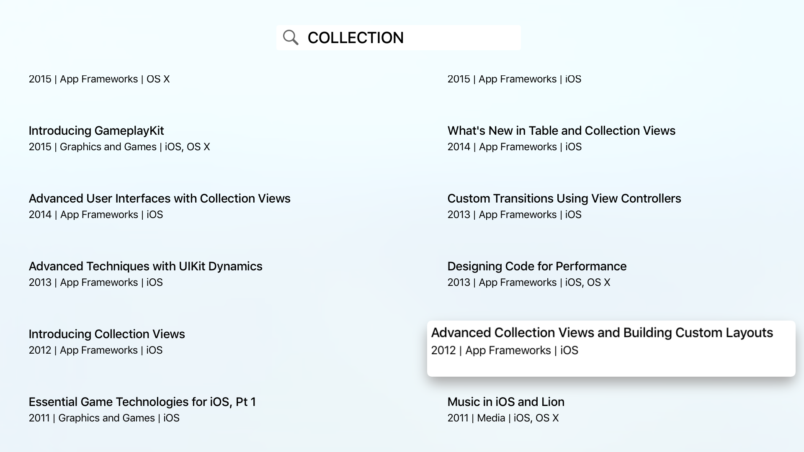

# WWDC app for the new Apple TV

This is a personal fork of the brilliant work done by [Guilherme Rambo](https://github.com/insidegui) to improve access to the Apple WWDC video sessions. I first ran into his [WWDC for OSX](https://github.com/insidegui/WWDC) app a year ago. At the time I made some local only changes to categorize the sessions which I since then rewrote and pushed back.

When I bought the latest generation AppleTV, I naturally looked for an Apple sanctionned WWDC app... to no avail. Fortunately Guilherme had already filling the void left by Apple with his [WWDC for tvOS](https://github.com/insidegui/WWDC-tvOS). As I started a more systematic revisiting past year sessions, I ran a couple of limitations that I decided to address in this codebase. As the changes are more substantial (and will be even more in the future), I am storing them here for the moment.

## Screenshots

### Main Screen

The sessions are organized per year, and grouped by track within a given year.

Although unconventional for tvOS, the sessions are at the moment presented on the left hand side of the screen:

### Searching

Seaching for a particular session is via an expected Search item in the top bar

Results are currently presented in two columns, with a behavior reminicent of the normal selection highlight present in UITableView (this is a UICollectionView)

### Top Shelf Extension

## Build Instructions

* Important: building requires Xcode 7.1.1 or later.

* To run this on an actual Apple TV you must have a paid developer account.

The only steps required before you build is to pull down the code and submodules:

	$ git clone --recursive https://github.com/insidegui/WWDC-tvOS.git
	
## AppStore?

I do not intend to put this on the AppStore, Apple would probably reject It and they're probably working on an official WWDC app anyway. This is just a temporary solution for those who want to watch sessions on their new Apple TV ;)
